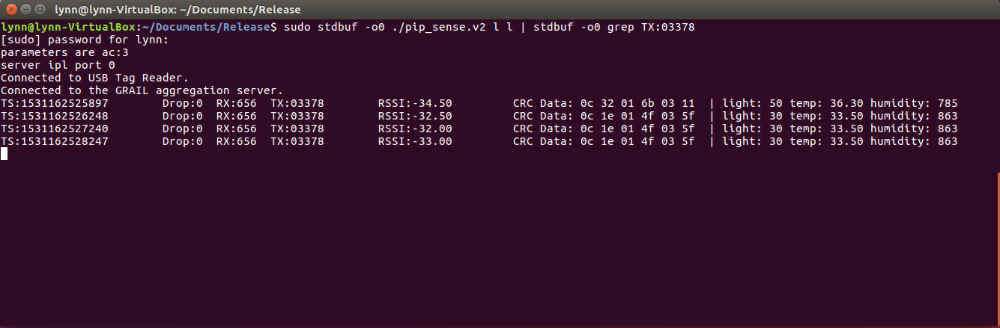
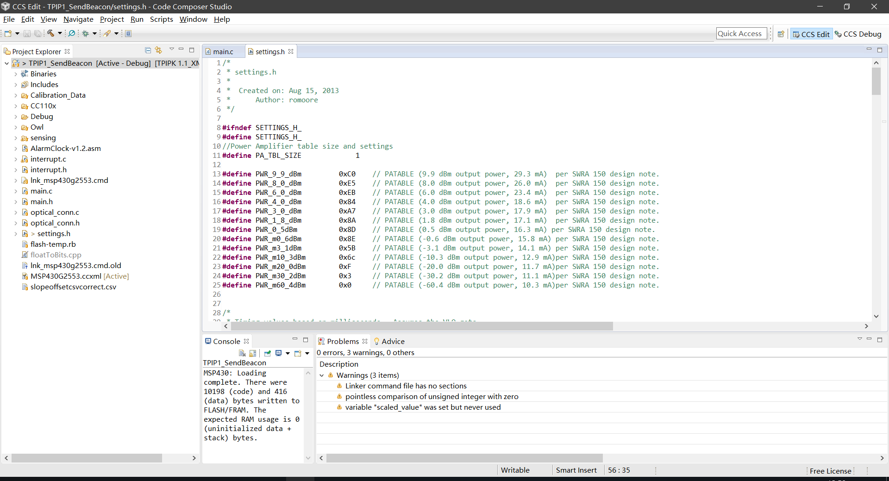
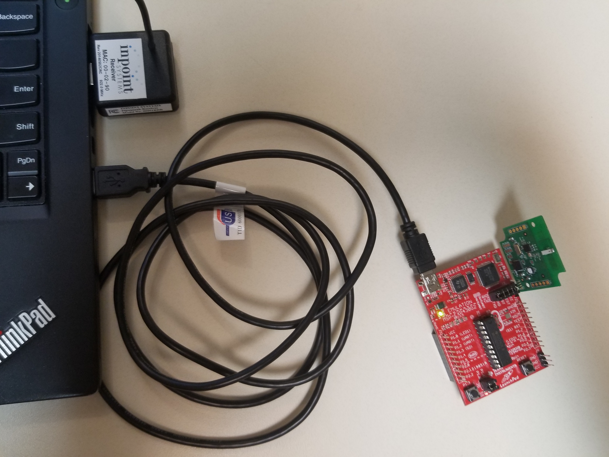
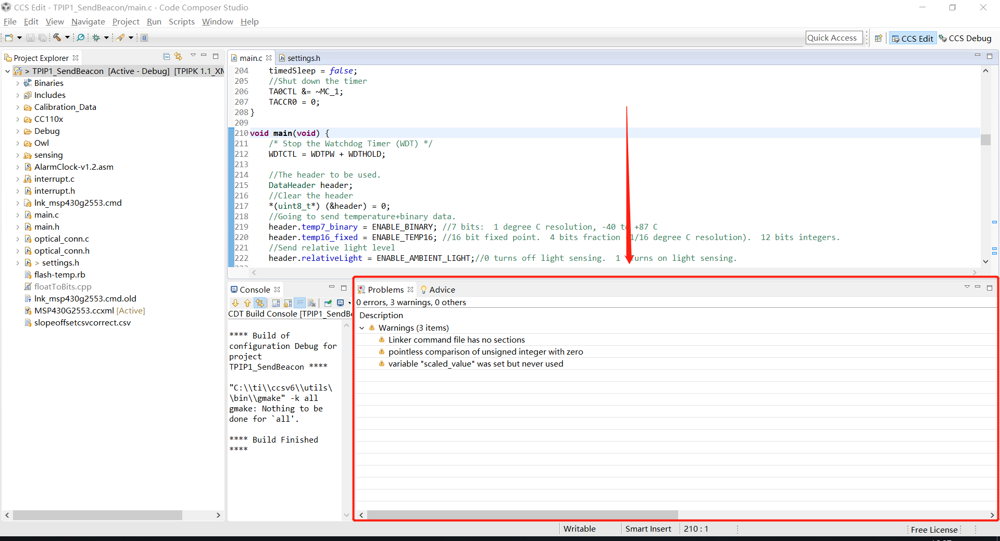
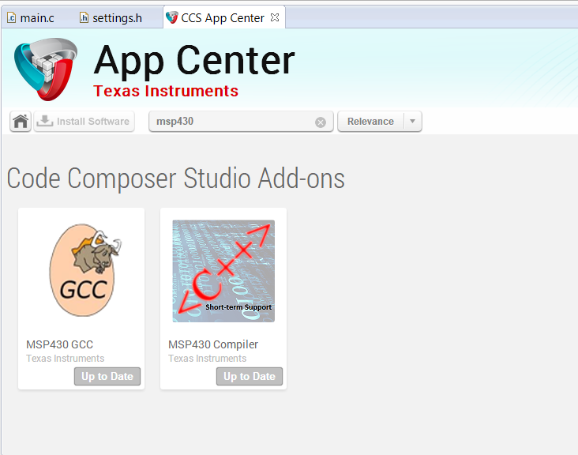

# Tutorial for PIP-Tag

### Hardware Prerequisite:
 1. USB receiver plugged in.
 2. PIP tag installed with a battery.

### Programs

File Structure

```
├── README.md
├── pip_sense.v2
├── pip_sense_layer.v2.cpp
├── sample_data.hpp
├── sensor_aggregator_protocol.hpp
└── simple_sockets.hpp
```

- .hpp files are dependency libraries that are required while compiling/making.  
- pip_sense_layer.v2.cpp is the original C++ file which contains the program.
- pip_sense.v2 is the compiled file from pip_sense_layer.v2.cpp.

 **How to compile/make file.**

- dependencies:
  > g++ gnu compiler

  > essential (install: `sudo apt-get install build-essential`)
 
  > usblib ( install: `sudo apt-get install libusb-dev`)
 
  > sample_data.hpp
 
  > simple_sockets.hpp
 
  > sensor_aggregator_protocol.hpp
 
  > *libcurl

- compile:

  - Open terminal in the folder and run

    `$ g++ -g -std=gnu++0x -o pip_sense.v2 pip_sense_layer.v2.cpp -lusb`
    
    And we would get file 'pip_sense.v2' in the current folder.
    
    *`g++` is the command to call g++ compiler. `-g` requests that the compiler and linker generate and retain symbol information in the executable itself ([click here](https://stackoverflow.com/questions/5179202/gcc-g-what-will-happen) for details) which makes it easy to debug. `-std=gnu++0x` set the C++ standard to 0x (like 08). `-o pip_sense.v2` set output mode to output compiled file namd as 'pip_sense.v2 saving in the save folder'. `-lusb` links two libraries to compiler.

 **How to run and collect data in the terminal.**

- general: 
  
  `$ sudo stdbuf -o0 ./pip_sense.v2 l l | stdbuf -o0 grep TX:0$1 |tee $2`

- my: (in order to receive msg from Tag: 03378)
  
  `$ sudo stdbuf -o0 ./pip_sense.v2 l l | stdbuf -o0 grep TX:03378`
  
  *`sudo` adminstrator permission is required since it uses usb connection. `stdbuf -o0` set buffering as none. `./pip_sense.v2 l l`, the path of the file follows with two parameters means using localhost. `grep` use a regular expression to match 03378 or 0$1. `tee` redriect data stream to both the screen and the file.
   
Result:



# How to flash the PIP tag (optional)

### Hardware Prerequisite:
 1. TI MSP-EXP430G2 LaunchPad.
 2. mini USB cable.
 3. PIP tag.
 4. USB receiver plugged in. (for debugging)

They are (from left to right) LaunchPad, PIP tag and Receiver.


### Programs
- Required 
  > Code Composer Studio (Checked avalible on Version: 6.1.1) with c++ compiler v 4.4.5 installed
  
  > LaunchPad MSP-EXP430G2 Driver (download from Texas Instruments offical site)

- File Structure (important files are listed only)
The code provided has a default setting which specifies a message sending frequence of once per ten second.   
```
PIP1_SendBeacon
├── ...
├── main.c
├── main.h
├── floatToBits.cpp
├── settings.h
├── ...
```

Steps for flashing

 1. open IDE
 
 
 
 2. in setting.h line 56 
 
 ```
 #define TXER_ID 3378	//0xABBADABA is default ID for automatic flashing
 ```
 Change the `3378` to the ID of the PIP tag you want to flash, it is 3378 for my PIP tag.

   - Change the frequency of sending data on line 89
 ```
 // How often MSP will wake up and check to see if sensing is required.
 // If WAKE_INTVL < PACKTINTVL_MS then MSP can go back to sleep without transmission.
 #define WAKE_INTVL MS_TEN_SECOND

 // How frequently to transmit a packet when no data is "sensed"
 // This will be the "heartbeat" transmission period.
 #define PACKTINTVL_MS MS_TEN_SECOND
 ```
   Read the comment and try to change both `MS_TEN_SECOND` to `MS_ONE_SECOND` to change the frequence from once per ten second to once per second.
 
 // more options for setting.h
 
 
 3. Connect the program LaunchPad to PC and PIP tag like this. Remember to uninstall the battery before flashing.
 
  
 
 4. Simply click build, debug and result button in debug view in Code Composer step by step. If you succeed, you can receive the data from this PIP tag in terminal without installing the battery.
 
 
### Flash Code Troubleshooting
  
  1. (from original readme.md) Due to the use of GCC attributes for packing structs, you need to enable GCC compatibility mode. This is an option found in the Project Properties dialog window.

   Project > Properties > CCS Build > MSP430 Compiler > Advanced Options > Language Options > Enable support for GCC extensions (--gcc)

   You also need to exclude "floatToBits.cpp" from the build if it is causing errors.  Be sure to select all builds you have configured in the dialog window.

   Right-Click > Resource Configurations > Exclude from Build...
  
  2. The original program is created with compiler version 3.3.3 but is no longer downloadable, use version 4.4.5 or 4.4.8 as an alternative. Compiler version 18.1.2 LTS is confirmed not working.
  
  Project > Properties > General > Compiler Version > Select TI v4.4.5/TI v4.4.8
  
  If there is no such selection like TI v4.4.5/v4.4.8. It may show the compiler do not match in the warning dialog.
  
  
  
  
  CCS APP CENTER
  
  Click into warning details and there could be a link to CCS APP CENTER download a compiler and try again. If this does not work, download TI compiler v4.4.8 [ti_cgt_msp430_4.4.8_windows_installer.exe](downloads) or from [official website](http://software-dl.ti.com/codegen/non-esd/downloads/download.htm#MSP430), install and do following steps.
  
  Project > Properties > General > Compiler Version > More > Select a new compiler from file-system > Browse (the compiler path).


